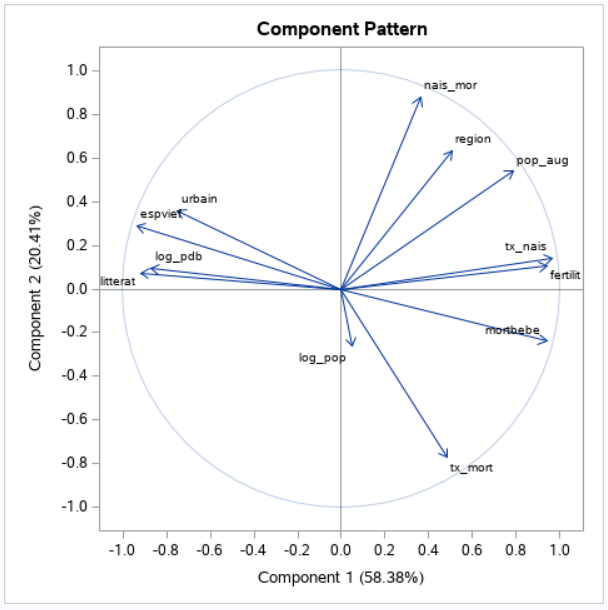

# Data analysis of the world population :

## Intro :

The study concerns 109 countries around the world on which different population variables are measured. Below is an extract of the data to be processed.

pays : pays,
urbain : predominant religion,
religion : Systolic index,		
espvief : Average life expectancy of women,
litterat : people able to read (%),
pop_aug : Population increase (% per year),
mortbebe : Infant mortality (per 10),
region : region or economic group,
tx_nais : Number of births (per 1000 people),
tx_mort : number of deaths (per 1000 people),
log_pdb : Log (base 10) of pdb_tet,
nais_mor : nb of births/nb of deaths ratio,
fetilit : average number of children.

The main objective of this study is to determine a typology between countries according to different criterias only by using a limited set of common factors.

## Step 1 : univariate and two-dimensional descriptive analysis on the variables of the problem

By comparing the means between the different regions, we notice that regions 1 and 2 have very good indices, because they have a life expectancy and a level of literacy or even a fairly high urban planning rate compared to to other regions. In addition, these two regions have a very low infant mortality rate (6.9 for region1 against 94.2 for region4). 

On the other hand, regions 3 and 4 have low indices. Indeed, life expectancy and literacy level are very low compared to other regions.

With that in mind, we can say that regions 1 and 2 represent the most developed countries among those studied. On the other hand, regions 3 and 4 include the countries that are the least developed of the countries present in this study. For regions 5 and 6 when they are a bit in the middle of the stadium, we can say that they are developing countries or moderately developed countries.

As far as Morocco is concerned, we can find it grouped with region 4 countries (see below).

Correlation matrix :

This matrix shows correlation relationships that seem to be predictable for this study. Indeed, the espvief variable (average life expectancy of women) is positively correlated with the variables urban and littertat; which is normal because when a woman is in urban environment, she will be close to hospitals and health services, therefore more likely to live. This variable is negatively correlated with the variable mortbebe, this means that higher the infant mortality is, life expectancy is likely to be lower.

We also notice that the variable tx_nais (number of births per 1000) is correlated with the variable mortbebe. thus, a high birth rate implies an increased likelihood that these children will die by the age of 10 (mortbebe).

Finally, we see a correlation of the variable pop_aug (population increase) with the two variables tx_nais and fertility at the same time. This is normal since fertility and birth rate often have a direct influence on the population of a country.

## Step 2 : utilizing the principal component analysis method (PCA) for the reduction of dimensions

The objective of PCA is to return to a space of reduced dimensions (2 in most cases) while distorting reality as little as possible. It is therefore a question of obtaining the most relevant summary possible of the initial data. The PCA technique is used especially when the explanatory variables are quantitative, which is the case for our study.

The table below represents the proportion explained by the factors extracted :

We can be satisfied with working with only two axes since the cumulative proportion of the first two factors represents 78.78% of the information. Moreover, the graph of the eigenvalues versus the principal components (below) shows the same thing.

The linear correlation coefficients between the initial variables and the factors can make it possible to give a meaning to the factors and possibly to interpret them. However, we will need the matrix of correlation variables-factors.
The coordinates of the variables are given by the table of eigenvectors below:

Correlation circle (Component pattern) can be visualised using the graph of variable :

The cloud of points can be visualised using the graph of individuals :

## Step 3 : summary of the analysis based on the results obtained

By observing the graph of variables, we can determine the interpretation of each of the dimensions. For the first axis, we notice that it is positively correlated with the variables tx_nais, fertit and mortbebe. We can therefore say that **axis 1 can be interpreted as the axis of demographic representation of a country**.

This is verified otherwise by the negative correlation which exists between the first axis with the two variables espvief and literat. Indeed, the values of the variable espvief (average life expectancy of women) decrease when the demographic indices of birth rate (or population increase), fertility and infant mortality are high in a country. In addition, the literat variable values increase when there is a decrease in the demographic indices of the population in a country.

Regarding axis 2, we see that it is positively correlated with the variable nais_mort (ratio of number of births / number of deaths), and that it is negatively correlated with the variable tx_mort (number of deaths per 100 people) . Consequently, we can say that **axis 2 highlights an opposition between the number of births and the number of deaths in a country**.